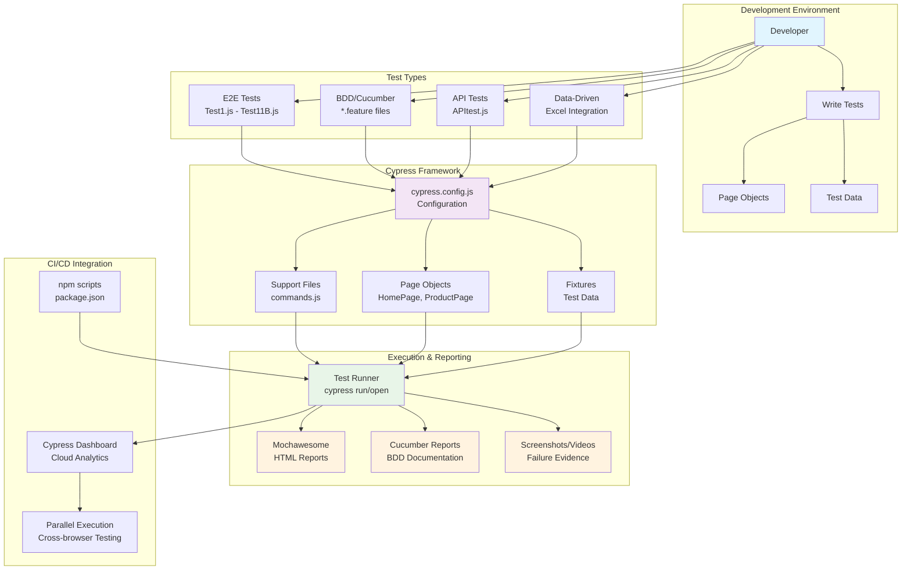
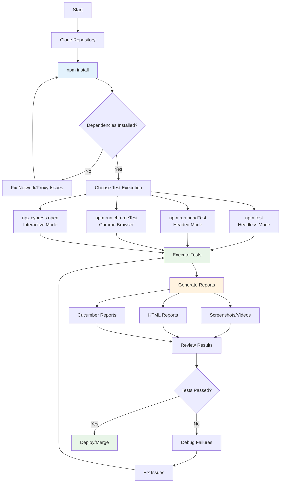
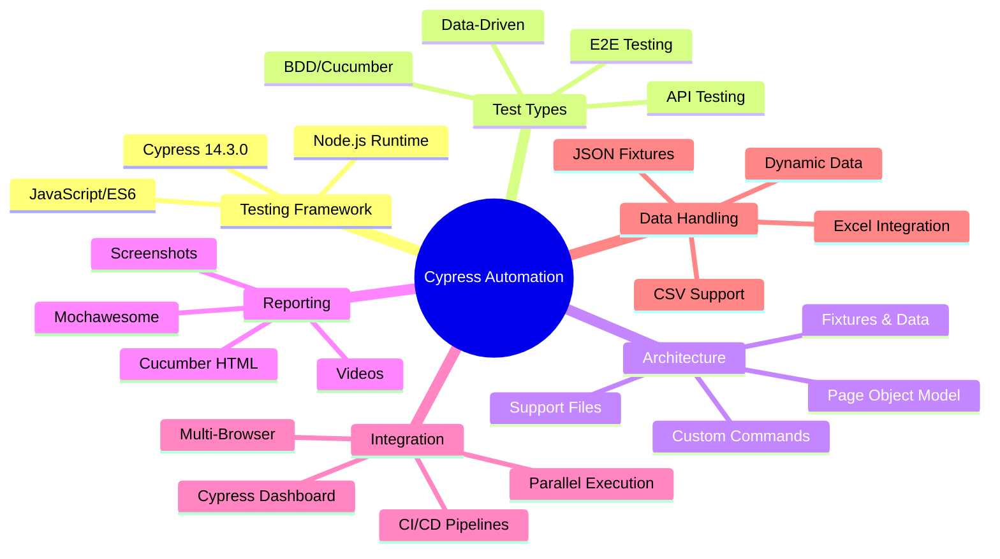

# Project Architecture Overview

```mermaid
graph TB
    subgraph "Development Environment"
        A[Developer] --> B[Write Tests]
        B --> C[Page Objects]
        B --> D[Test Data]
    end

    subgraph "Test Types"
        E[E2E Tests<br/>Test1.js - Test11B.js]
        F[BDD/Cucumber<br/>*.feature files]
        G[API Tests<br/>APItest.js]
        H[Data-Driven<br/>Excel Integration]
    end

    subgraph "Cypress Framework"
        I[cypress.config.js<br/>Configuration]
        J[Support Files<br/>commands.js]
        K[Page Objects<br/>HomePage, ProductPage]
        L[Fixtures<br/>Test Data]
    end

    subgraph "Execution & Reporting"
        M[Test Runner<br/>cypress run/open]
        N[Mochawesome<br/>HTML Reports]
        O[Cucumber Reports<br/>BDD Documentation]
        P[Screenshots/Videos<br/>Failure Evidence]
    end

    subgraph "CI/CD Integration"
        Q[npm scripts<br/>package.json]
        R[Cypress Dashboard<br/>Cloud Analytics]
        S[Parallel Execution<br/>Cross-browser Testing]
    end

    A --> E
    A --> F
    A --> G
    A --> H

    E --> I
    F --> I
    G --> I
    H --> I

    I --> J
    I --> K
    I --> L

    J --> M
    K --> M
    L --> M

    M --> N
    M --> O
    M --> P

    Q --> M
    M --> R
    R --> S

    style A fill:#e1f5fe
    style I fill:#f3e5f5
    style M fill:#e8f5e8
    style N fill:#fff3e0
    style O fill:#fff3e0
    style P fill:#fff3e0
```

## Build Process Flow

```mermaid
flowchart TD
    A[Start] --> B[Clone Repository]
    B --> C[npm install]
    C --> D{Dependencies Installed?}
    D -->|No| E[Fix Network/Proxy Issues]
    E --> C
    D -->|Yes| F[Choose Test Execution]
    
    F --> G[npm test<br/>Headless Mode]
    F --> H[npm run headTest<br/>Headed Mode]
    F --> I[npm run chromeTest<br/>Chrome Browser]
    F --> J[npx cypress open<br/>Interactive Mode]
    
    G --> K[Execute Tests]
    H --> K
    I --> K
    J --> K
    
    K --> L[Generate Reports]
    L --> M[Screenshots/Videos]
    L --> N[HTML Reports]
    L --> O[Cucumber Reports]
    
    M --> P[Review Results]
    N --> P
    O --> P
    
    P --> Q{Tests Passed?}
    Q -->|No| R[Debug Failures]
    Q -->|Yes| S[Deploy/Merge]
    
    R --> T[Fix Issues]
    T --> K
    
    style C fill:#e3f2fd
    style K fill:#e8f5e8
    style L fill:#fff3e0
    style S fill:#e8f5e8
```

## Technology Stack

```mermaid
mindmap
  root((Cypress Automation))
    Testing Framework
      Cypress 14.3.0
      Node.js Runtime
      JavaScript/ES6
    Test Types
      E2E Testing
      BDD/Cucumber
      API Testing
      Data-Driven
    Architecture
      Page Object Model
      Custom Commands
      Fixtures & Data
      Support Files
    Reporting
      Mochawesome
      Cucumber HTML
      Screenshots
      Videos
    Integration
      CI/CD Pipelines
      Cypress Dashboard
      Multi-Browser
      Parallel Execution
    Data Handling
      Excel Integration
      JSON Fixtures
      CSV Support
      Dynamic Data
```